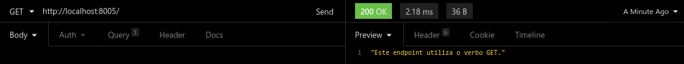

# API REST
1º Exercício da 2º unidade de Programação Avançada.

As requisições foram feitas utilizando o Insomnia Designer.

Para iniciar o servidor API:
<pre>node src/server.js</pre>

Obs.: Lembrar de executar `npm install` na raiz do projeto (onde está o `package.json`) antes de executar o servidor da API.

## Exemplos de uso (utilizando o Insomnia Designer):

Letra A

Letra B

Letra C

Letra D

Letra E

Letra F

